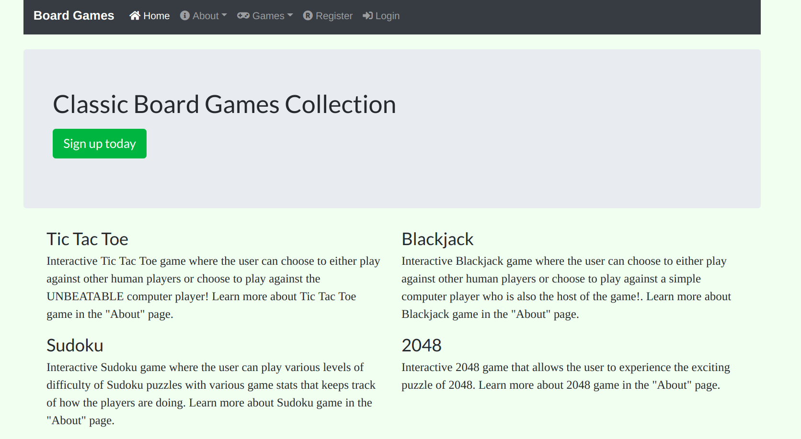
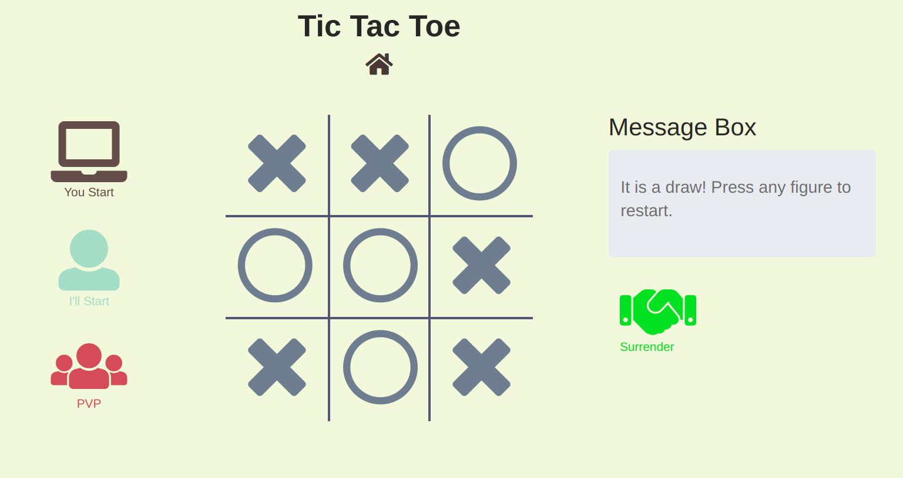
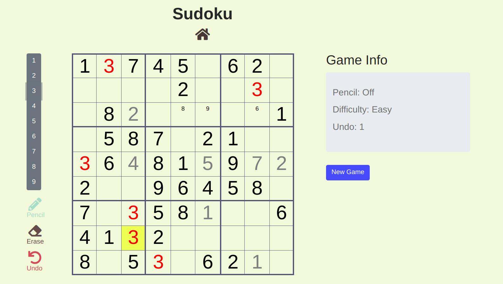

# PyBoardGame

## About
This website contains a collection of board games for users to enjoy, as well as various guides for the games.
The web app is built using Python 3 Flask web framework, along with JavaScript and Jquery for several features of the games.

The website is hosted on Heroku, here is the link: https://pyboardgame.herokuapp.com/

NOTE: This repo is no longer being maintained. An updated version is at: https://github.com/larryworm1127/classic-games

## Features
Here is a list of possible features that will be implemented:
- [ ] A secure database user authentication.
- A number of simple board games for users to play:
    - [x] Tic Tac Toe
    - [ ] 2048
    - [x] Sudoko
    - [ ] Blackjack
    - [ ] Etc.
- [ ] A leveling and coin system

## Screenshots
Here are some screenshot of the website:

**_Home Page:_**

**_Tic Tac Toe:_**

**_Sudoku:_**

Steps to deply

  sudo apt update
  sudo apt-get update -y
  sudo apt-get upgrade -y
  sudo apt-get install python3 python3-pip python3-dev build-essential libssl-dev libffi-dev python3-setuptools -y
  sudo apt-get install python3-venv -y
  sudo apt-get install nginx -y
  sudo systemctl start nginx
  sudo systemctl status nginx
  mkdir GameApp
  ls
  cd GameApp/
  python3 –-version 
  python3 -m venv Tech-Guardians
  ls
  source Tech-Guardians/bin/activate
  ls
  pip install wheel
  pip install flask
  git clone https://github.com/Jahmeeu-Cloud/PyBoardGame.git
  ls
  cd PyBoardGame/
  pip install -r requirements.txt
  ls
  pip install flask-cors
  nano run.py app.run (host='0.0.0.0', port=5000)
  python3 run.py

